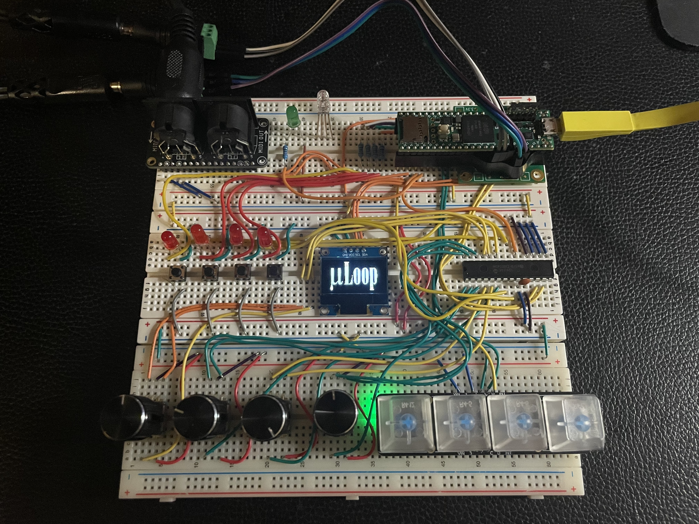

# μLoop: Minimal Live Looper & Sampler

MIDI-synced micro-looper for live performance, inspired by the French House sound of greats like Justice, Mr. Oizo, and SebastiAn.

## Features

- **Real-time audio effects**: Choke, stutter, and freeze effects applied to line-in audio with click-free crossfades
- **MIDI-synchronized quantization**: Locks to external MIDI clock (24 PPQN) with exponential moving average jitter smoothing
- **Parameter control**: 4× rotary encoders with ISR-based quadrature decoding (100% step accuracy)
- **Visual feedback**: 128×64 OLED display with bitmap-based menu system
- **Effect presets**: Save and recall parameter configurations

## Architecture

**Hardware**: ARM Cortex-M7 @ 600MHz (Teensy 4.1) + SGTL5000 audio codec + MCP23017 GPIO expander

**Software**: Custom CMake build system, C++17, zero-allocation DSP engine

**Threading model**: Deterministic multithreaded architecture with:
- High-priority audio ISR (44.1kHz, 128-sample blocks)
- 5 control threads (MIDI I/O, input polling, display updates, encoder handling, app logic)
- Lock-free SPSC queues for non-blocking inter-thread communication

**Key components**:
- Custom SGTL5000 register-layer driver (I²C codec configuration)
- TimeKeeper: Centralized timing authority bridging MIDI clock and audio samples
- Sample-accurate quantization API for beat/bar-aligned recording and playback
- Effect system with polymorphic command dispatch

**Real-time safety**: `-fno-exceptions -fno-rtti`, no dynamic allocation in audio path, wait-free data structures

## Technical Highlights

- **Sub-millisecond effect latency**: ISR state capture with 64-event ring buffer (~26µs response time)
- **Professional timing**: EMA-smoothed MIDI clock with atomic beat boundary detection
- **Click-free audio**: 10ms linear crossfades on all effect transitions
- **Zero missed steps**: Hardware-frozen encoder state via MCP23017 INTCAP registers

Built with a focus on deterministic performance, cache-friendly data structures, and real-time-safe design patterns.
